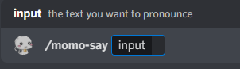
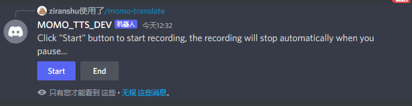
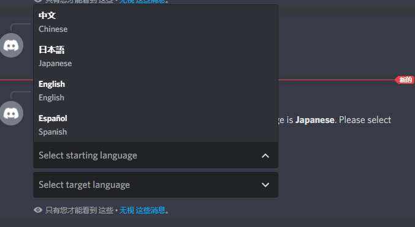

# Momo Bot - A Speech-to-speech Discord translation robot
This is a simple Discord bot that does speech translation and speech generation. Currently, this bot can do following functionalities:
- connect to your voice channel and read the text you want it to read
- connect to your voice channel and do the real-time translation for you

This bot is based on [Azure Cognitive Service](https://azure.microsoft.com/en-us/services/cognitive-services/#overview). One can quickly deploy a TTS bot based on this source code. 

## Deploy Guide
### Create a Discord Bot
Follow [this tutorial](https://discordjs.guide/preparations/setting-up-a-bot-application.html#creating-your-bot) to create your bot, remember to copy your token.

After creating your Bot, you can follow [this tutorial](https://v12.discordjs.guide/preparations/adding-your-bot-to-servers.html#bot-invite-links) to get the link to add your bot. Note that the client_id in the link needs to be changed to your `application id` from your Discord developer portal.

### Create Azure Subscription and Resource
1. [create an Azure subscription](https://azure.microsoft.com/en-us/free/cognitive-services/)
2.  [create a speech resource](https://portal.azure.com/#create/Microsoft.CognitiveServicesSpeechServices)
3.  Get the resource key and region. After your Speech resource is deployed, select Go to resource to view and manage keys. For more information about Cognitive Services resources, see [Get the keys for your resource](https://docs.microsoft.com/en-us/azure/cognitive-services/cognitive-services-apis-create-account?tabs=multiservice%2Cwindows#get-the-keys-for-your-resource).

### Install Dependency and prerequirement
To run this bot, you'll need:
- [NodeJS (16 or newer)](https://nodejs.org/)

After you install NodeJS, you can install all project dependency:
```bash
npm i
``` 

### Create config.json file
You'll need to create a `config.json` file to contain all your personalized informations, a config.json file looks like this:
```json
{
    "discordToken": "OTk1ND**********************WyI",
    "discordClientId": "9954************************",
    "azureResourceKey": "bf8dc3***********************",
    "azureRegion": "eastus"
}
```
where you can find your **discordClientId** and **discordToken** from the [discord developer portal](https://discord.com/developers). The Azure resource key and region can be found from [this link](https://docs.microsoft.com/en-us/azure/cognitive-services/cognitive-services-apis-create-account?tabs=multiservice%2Cwindows#get-the-keys-for-your-resource).

put your config.json file at the root directory of this project.

### Start the bot
Now you can start your bot by:
```bash
node index.js
```

### Personalize your language preference
By default, the bot is using `en-US-JennyNeural` voice and English language. You can specify your own by modifying the `config.json` file's **'speechSynthesisVoiceName'** field, for example: 
```json
{
    "discordToken": "OTk1ND**********************WyI",
    "discordClientId": "9954************************",
    "azureResourceKey": "bf8dc3***********************",
    "azureRegion": "eastus",
    "speechSynthesisVoiceName": "zh-CN-YunxiNeural"
}

```
You can find the list of different voice [here](https://docs.microsoft.com/en-us/azure/cognitive-services/speech-service/language-support?tabs=speechtotext#text-to-speech).

## Usage
### Speech Synthesis
You can call command `/momo-say` to call a robot to your current channel. The command comes with a prompt to ask you to input the things you want to say, like the following figure:
. You can input whatever you want the bot to speak here. (*NOTE: you need to make sure what language you want the bot to talk about and specify in your config file as instructed in the previous section*)

### Speech Translation
You can use command `/momo-translate` to call a robot to your current voice channel and start translating what you are saying. The prompt looks like this:



Click 'Start' and you can start talking, the bot will automatically detect your pause and start translating, after translating, the bot will read the translation directly to the same voice channel. Make sure your mic is on, otherwise the bot will wait for you for a long time because you never break the silence.

To set different languages for translation, use command `/momo-set-translation`, this will call a prompt that you can choose different starting and targeting languages:



Choose the language you want and the bot will automatically update.

# Advanced Usage
## Working with database & sharding
If you want to use this bot as a public bot and save per-server configuration, you'll need a database for consistency and sharding (if your bot's workload is heavy). This project focus on the NodeJS implementation of a speech bot, as there are many different database choices, we don't implement a database in this project. However, we leave a nice and easy interface for other developers to implement whatever the database they are using.

The current per-server setting are all stored in the memory, and handled in a centralized way a **ServerStatesHandler** class. The code for this class is in `bot/states/serverStates.js`. To make it consistant with a database, you only need to override two methods, the `setServerState` and `getServerState` methods. Here is a psuedo code for that:
```js
class YourServerStatesHandler extends ServerStatesHandler {
  setServerState(serverId, newState) {
    super.setServerState(serverId, newState)
    /* Store (serverId, newState) key value pair to your favorite database here */
  }

  getServerState(serverId) {
    /* state <= get your state from your database by query serverId key */
    return state;
  }
}
```
## add more translation language
For translation, we only put four language here, you can easily add more lanuages or delete languages by modify the **LanguageSettings** constant in `bot/states/serverStates`, the language code is in ISO-639, the locale code and voice name can be found [here](https://docs.microsoft.com/en-us/azure/cognitive-services/speech-service/language-support?tabs=speechtotext#text-to-speech).

